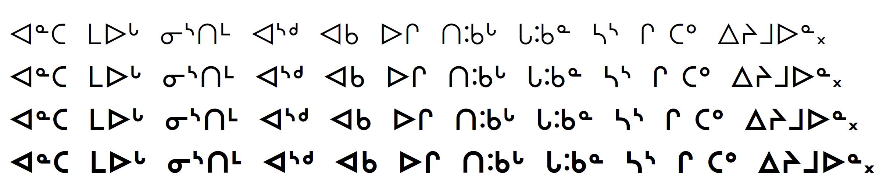

The **BJCree** font is a Canadian Syllabics font in the style preferred by Cree and Naskapi communities of Canada. It was originally designed in collaboration with the persons who speak these languages around James Bay.

The glyph shapes and metrics were designed for these languages intending to strike a balance between the local usage and preferences of literate speakers and the syllabic character shapes found in traditional Cree religious literature and hymnbooks, especially publications and translations by Bishop John Horden, and Rev. William Walton. These works, originally published by the Society for the Promotion of Christian Knowledge (SPCK) and the British and Foreign Bible Society in Great Britain, were widely distributed in the regions around James Bay and still in common use by Cree and Naskapi speakers in the 1990s when the digital font was being developed.

BJCree’s design is intended to be highly readable, consistent, and visually familiar. One design strategy for greater readability is to provide much more generous white space between words than in many other Canadian Syllabic fonts. Also, a consistent stroke width and curve radius for the rounded characters that echoed the familiar design of the fonts used in legacy religious literature made the font broadly acceptable and widely used in literacy and education.

Four fonts from this typeface family are included in the **BJCree** release:

* BJCree Regular
* BJCree Medium
* BJCree SemiBold
* BJCree Bold

The Latin glyphs are based on C059 (New Century Schoolbook) from (URW)++, released under the SIL Open Font License version 1.1.

## Type Samples

Type samples showing some of the inventory of glyphs can be found here: 
[BJCree Type Sample](sample.md).

Examples of some text is shown below. 

{.fullsize}
<!-- PRODUCT SITE IMAGE SRC https://software.sil.org/bjcree/wp-content/uploads/sites/74/2026/01/4weights.png -->
<figcaption>BJCree Sample - Four weights</figcaption>

