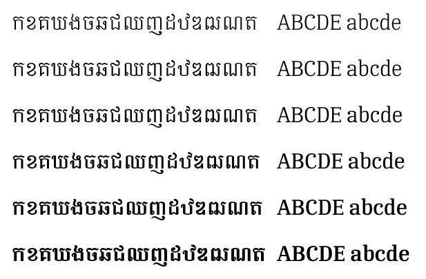
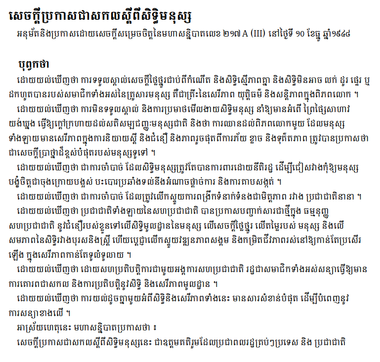

Six fonts for this typeface family are included in the *Busra* release:

- Busra ExtraLight
- Busra Light
- Busra Regular
- Busra Medium
- Busra SemiBold
- Busra Bold

## Type Samples

The Busra font supports the following Khmer characters:

កខគឃងចឆជឈញដឋឌឍណតថ

	

ទធនបផពភមយរលវឝឞសហ

	

ឡអឣឤឥឦឧឨឩឪឫឬឭឮឯឰឱឲ

	

ា ិ ី ឹ ឺ ុ ូ ួ ើ ឿ ៀ េ ែ ៃ ោ ៅ

 ំ ះ ៈ ៉   ៊ ់ ៌ ៍ ៎ ៏ ័ ៑ ្ ៓

០១២៣៤៥៦៧៨៩

	

។ ៕ ៖ ៗ ៘ ៙ ៚ ៛ ៜ ៝   

	

៰៱៲៳៴៵៶៸៹

		
The following shows the six weights:

{.fullsize}
<!-- PRODUCT SITE IMAGE SRC https://software.sil.org/busra/wp-content/uploads/sites/75/2025/02/sample_weights.png -->

An example of some text using Busra is shown below.

{.fullsize}
<!-- PRODUCT SITE IMAGE SRC https://software.sil.org/busra/wp-content/uploads/sites/75/2025/02/udhr.png -->
<figcaption>Busra sample - Universal Declaration of Human Rights</figcaption>

## Character Set

For a complete list of characters included in Busra, see [Character Set Support](charset.md).

## Font Features

Alternate glyphs that are available through features are demonstrated in the [Features](features.md) document.

<!-- PRODUCT SITE ONLY
[font id='busra' face='Busra-Regular' size='150%']
-->
