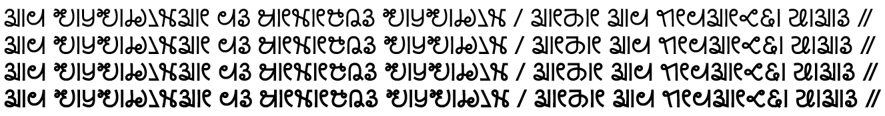

Kanchenjunga is a font loosely based on the handwriting style of Kirat Rai which was used in some of the early reading primers for Kirat Rai.

Four fonts for this typeface family are included in the *Kanchenjunga* release:

- Kanchenjunga Regular
- Kanchenjunga Medium
- Kanchenjunga SemiBold
- Kanchenjunga Bold

## Type Samples

Type samples showing some of the inventory of glyphs can be found here: 
[Kanchenjunga Type Sample](sample.md).

One example of some text is shown below. 

{.fullsize}
<!-- PRODUCT SITE IMAGE SRC https://software.sil.org/kanchenjunga/wp-content/uploads/sites/71/2024/09/kanchenjunga_weights.png -->
<figcaption>Kanchenjunga Sample - Four weights</figcaption>

## Character Set

For a complete list of characters included in Kanchenjunga, see [Character Set Support](charset.md).

## Font Features

Alternate glyphs that are available through features are demonstrated in the [Features](features.md) document. 

