# Encoded Symbols

These are the encoded characters in the SymChar fonts. The symbols representing common "invisible" characters are shown in context. The Fonts column indicates which of the SymChar fonts contain that symbol - SymChar (S), SymCharK (K).

Image | USV | Fonts | Description | Represents
----- | --- | ----- | ----------- | ----------
 | U+E080 | SK | SPACE | U+0020
 | U+E082 | SK | NO-BREAK SPACE | U+00A0
 | U+E083 | SK | NARROW NO-BREAK SPACE | U+202F
 | U+E084 | SK | EN QUAD | U+2000
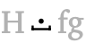 | U+E085 | SK | EM QUAD | U+2001
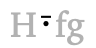 | U+E086 | SK | EN SPACE | U+2002
 | U+E087 | SK | EM SPACE | U+2003
 | U+E088 | SK | THREE-PER-EM SPACE | U+2004
 | U+E089 | SK | FOUR-PER-EM SPACE | U+2005
 | U+E08A | SK | SIX-PER-EM SPACE | U+2006
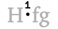 | U+E08B | SK | FIGURE SPACE | U+2007
 | U+E08C | SK | PUNCTUATION SPACE | U+2008
 | U+E08D | SK | THIN SPACE | U+2009
 | U+E08E | SK | HAIR SPACE | U+200A
 | U+E08F | SK | IDEOGRAPHIC SPACE | U+3000
 | U+E081 | SK | ZERO WIDTH SPACE | U+200B
 | U+E079 | SK | ZERO WIDTH NON-JOINER | U+200C
 | U+E075 | SK | ZERO WIDTH NON-JOINER (iOS) | U+200C
 | U+E076 | SK | ZERO WIDTH NON-JOINER (Android) | U+200C
 | U+E077 | SK | ZERO WIDTH JOINER | U+200D
 | U+E078 | SK | WORD JOINER | U+2060
 | U+E07A | SK | COMBINING GRAPHEME JOINER | U+034F
 | U+E090 | SK | LEFT-TO-RIGHT MARK | U+200E
 | U+E091 | SK | RIGHT-TO-LEFT MARK | U+200F
 | U+E0A1 | SK | SOFT HYPHEN | U+00AD
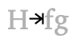 | U+E0A2 | SK | HORIZONTAL TABULATION | U+0009
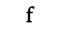 | U+E0B1 | SK | size reference - ascender | 
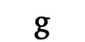 | U+E0B2 | SK | size reference - descender | 
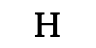 | U+E0B3 | SK | size reference - uppercase | 
 | U+E0B4 | SK | size reference - box | 
 | U+E010 | SK | uppercase | 
 | U+E011 | SK | lowercase | 
 | U+E003 | SK | caps | 
 | U+E020 | SK | caps_1 | 
 | U+E000 | SK | alt | 
 | U+E019 | SK | alt_1 | 
 | U+E001 | SK | ctrl | 
 | U+E002 | SK | altctrl | 
 | U+E056 | SK | left_alt | 
 | U+E057 | SK | right_alt | 
 | U+E058 | SK | left_ctrl | 
 | U+E059 | SK | right_ctrl | 
 | U+E060 | SK | left_alt_ctrl | 
 | U+E061 | SK | right_alt_ctrl | 
 | U+E062 | SK | left_alt_ctrl_shift | 
 | U+E063 | SK | right_alt_ctrl_shift | 
 | U+E064 | SK | shift_alt | 
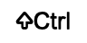 | U+E065 | SK | shift_ctrl | 
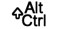 | U+E066 | SK | shift_alt_ctrl | 
 | U+E067 | SK | left_alt_shift | 
 | U+E068 | SK | right_alt_shift | 
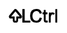 | U+E069 | SK | left_ctrl_shift | 
 | U+E070 | SK | right_ctrl_shift | 
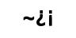 | U+E015 | SK | symbols | 
 | U+E013 | SK | digits | 
 | U+E014 | SK | currencies | 
 | U+E008 | SK | shift | 
 | U+E009 | SK | shifted | 
 | U+E073 | SK | shift_lock | 
 | U+E074 | SK | shifted_lock | 
 | U+E004 | SK | back | 
 | U+E021 | SK | back_1 | 
 | U+E022 | SK | back_2 | 
 | U+E072 | SK | back_rev | 
 | U+E06A | SK | back_rev_1 | 
 | U+E005 | SK | enter | 
 | U+E071 | SK | enter_rev | 
 | U+E006 | SK | next | 
 | U+E007 | SK | previous | 
 | U+E00A | SK | hide | 
 | U+E035 | SK | download | 
 | U+E045 | SK | download_1 | 
 | U+E055 | SK | download_2 | 
 | U+E025 | SK | close | 
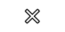 | U+E027 | SK | close_1 | 
 | U+E023 | SK | resize | 
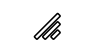 | U+E028 | SK | resize_1 | 
 | U+E024 | SK | pin | 
 | U+E026 | SK | pin_1 | 
 | U+E031 | SK | info | 
 | U+E041 | SK | info_1 | 
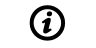 | U+E051 | SK | info_2 | 
 | U+E032 | SK | help | 
 | U+E042 | SK | help_1 | 
 | U+E052 | SK | help_2 | 
 | U+E030 | SK | gearwheel | 
 | U+E00B | SK | globe | 
 | U+E033 | SK | facebook | 
 | U+E043 | SK | facebook_1 | 
 | U+E053 | SK | facebook_2 | 
 | U+E034 | SK | twitter | 
 | U+E044 | SK | twitter_1 | 
 | U+E054 | SK | twitter_2 | 
 | U+0021 | K | EXCLAMATION MARK | U+0021
 | U+0022 | K | QUOTATION MARK | U+0022
 | U+0023 | K | NUMBER SIGN | U+0023
 | U+0024 | K | DOLLAR SIGN | U+0024
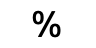 | U+0025 | K | PERCENT SIGN | U+0025
 | U+0026 | K | AMPERSAND | U+0026
 | U+0027 | K | APOSTROPHE | U+0027
 | U+0028 | K | LEFT PARENTHESIS | U+0028
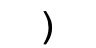 | U+0029 | K | RIGHT PARENTHESIS | U+0029
 | U+002A | K | ASTERISK | U+002A
 | U+002B | K | PLUS SIGN | U+002B
 | U+002C | K | COMMA | U+002C
 | U+002D | K | HYPHEN-MINUS | U+002D
 | U+002E | K | FULL STOP | U+002E
 | U+002F | K | SOLIDUS | U+002F
 | U+0030 | K | DIGIT ZERO | U+0030
 | U+0031 | K | DIGIT ONE | U+0031
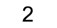 | U+0032 | K | DIGIT TWO | U+0032
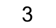 | U+0033 | K | DIGIT THREE | U+0033
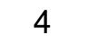 | U+0034 | K | DIGIT FOUR | U+0034
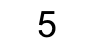 | U+0035 | K | DIGIT FIVE | U+0035
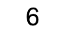 | U+0036 | K | DIGIT SIX | U+0036
 | U+0037 | K | DIGIT SEVEN | U+0037
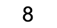 | U+0038 | K | DIGIT EIGHT | U+0038
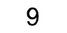 | U+0039 | K | DIGIT NINE | U+0039
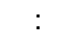 | U+003A | K | COLON | U+003A
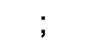 | U+003B | K | SEMICOLON | U+003B
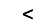 | U+003C | K | LESS-THAN SIGN | U+003C
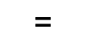 | U+003D | K | EQUALS SIGN | U+003D
 | U+003E | K | GREATER-THAN SIGN | U+003E
 | U+003F | K | QUESTION MARK | U+003F
 | U+0040 | K | COMMERCIAL AT | U+0040
 | U+0041 | K | LATIN CAPITAL LETTER A | U+0041
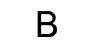 | U+0042 | K | LATIN CAPITAL LETTER B | U+0042
 | U+0043 | K | LATIN CAPITAL LETTER C | U+0043
 | U+0044 | K | LATIN CAPITAL LETTER D | U+0044
 | U+0045 | K | LATIN CAPITAL LETTER E | U+0045
 | U+0046 | K | LATIN CAPITAL LETTER F | U+0046
 | U+0047 | K | LATIN CAPITAL LETTER G | U+0047
 | U+0048 | K | LATIN CAPITAL LETTER H | U+0048
 | U+0049 | K | LATIN CAPITAL LETTER I | U+0049
 | U+004A | K | LATIN CAPITAL LETTER J | U+004A
 | U+004B | K | LATIN CAPITAL LETTER K | U+004B
 | U+004C | K | LATIN CAPITAL LETTER L | U+004C
 | U+004D | K | LATIN CAPITAL LETTER M | U+004D
 | U+004E | K | LATIN CAPITAL LETTER N | U+004E
 | U+004F | K | LATIN CAPITAL LETTER O | U+004F
 | U+0050 | K | LATIN CAPITAL LETTER P | U+0050
 | U+0051 | K | LATIN CAPITAL LETTER Q | U+0051
 | U+0052 | K | LATIN CAPITAL LETTER R | U+0052
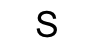 | U+0053 | K | LATIN CAPITAL LETTER S | U+0053
 | U+0054 | K | LATIN CAPITAL LETTER T | U+0054
 | U+0055 | K | LATIN CAPITAL LETTER U | U+0055
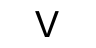 | U+0056 | K | LATIN CAPITAL LETTER V | U+0056
 | U+0057 | K | LATIN CAPITAL LETTER W | U+0057
 | U+0058 | K | LATIN CAPITAL LETTER X | U+0058
 | U+0059 | K | LATIN CAPITAL LETTER Y | U+0059
 | U+005A | K | LATIN CAPITAL LETTER Z | U+005A
 | U+005B | K | LEFT SQUARE BRACKET | U+005B
 | U+005C | K | REVERSE SOLIDUS | U+005C
 | U+005D | K | RIGHT SQUARE BRACKET | U+005D
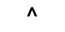 | U+005E | K | CIRCUMFLEX ACCENT | U+005E
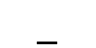 | U+005F | K | LOW LINE | U+005F
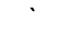 | U+0060 | K | GRAVE ACCENT | U+0060
 | U+0061 | K | LATIN SMALL LETTER A | U+0061
 | U+0062 | K | LATIN SMALL LETTER B | U+0062
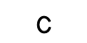 | U+0063 | K | LATIN SMALL LETTER C | U+0063
 | U+0064 | K | LATIN SMALL LETTER D | U+0064
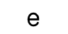 | U+0065 | K | LATIN SMALL LETTER E | U+0065
 | U+0066 | K | LATIN SMALL LETTER F | U+0066
 | U+0067 | K | LATIN SMALL LETTER G | U+0067
 | U+0068 | K | LATIN SMALL LETTER H | U+0068
 | U+0069 | K | LATIN SMALL LETTER I | U+0069
 | U+006A | K | LATIN SMALL LETTER J | U+006A
 | U+006B | K | LATIN SMALL LETTER K | U+006B
 | U+006C | K | LATIN SMALL LETTER L | U+006C
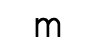 | U+006D | K | LATIN SMALL LETTER M | U+006D
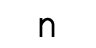 | U+006E | K | LATIN SMALL LETTER N | U+006E
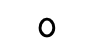 | U+006F | K | LATIN SMALL LETTER O | U+006F
 | U+0070 | K | LATIN SMALL LETTER P | U+0070
 | U+0071 | K | LATIN SMALL LETTER Q | U+0071
 | U+0072 | K | LATIN SMALL LETTER R | U+0072
 | U+0073 | K | LATIN SMALL LETTER S | U+0073
 | U+0074 | K | LATIN SMALL LETTER T | U+0074
 | U+0075 | K | LATIN SMALL LETTER U | U+0075
 | U+0076 | K | LATIN SMALL LETTER V | U+0076
 | U+0077 | K | LATIN SMALL LETTER W | U+0077
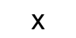 | U+0078 | K | LATIN SMALL LETTER X | U+0078
 | U+0079 | K | LATIN SMALL LETTER Y | U+0079
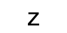 | U+007A | K | LATIN SMALL LETTER Z | U+007A
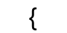 | U+007B | K | LEFT CURLY BRACKET | U+007B
 | U+007C | K | VERTICAL LINE | U+007C
 | U+007D | K | RIGHT CURLY BRACKET | U+007D
 | U+007E | K | TILDE | U+007E
 | U+00A3 | K | POUND SIGN | U+00A3
 | U+2022 | K | BULLET | U+2022
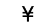 | U+00A5 | K | YEN SIGN | U+00A5
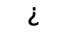 | U+00BF | K | INVERTED QUESTION MARK | U+00BF
 | U+00A1 | K | INVERTED EXCLAMATION MARK | U+00A1
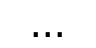 | U+2026 | K | HORIZONTAL ELLIPSIS | U+2026
 | U+20AC | K | EURO SIGN | U+20AC
